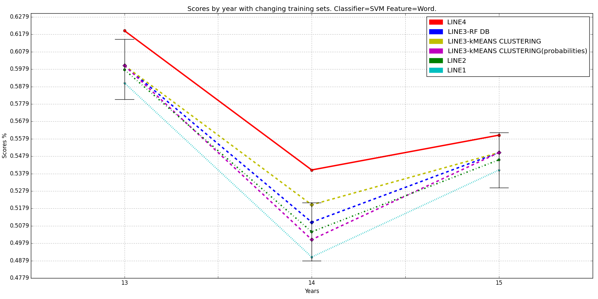

# Time Effect In Sentiment Analysis
This project is developed by [@meryem](http://github.com/meryem) and [@s](http://github.com/s) as a Bachelor Thesis in [Computer Engineering Department of YTU](http://ce.yildiz.edu.tr) with mentorship of [Assistant Prof. Dr. M. Fatih AMASYALI](https://scholar.google.com.tr/citations?user=qTUSAy0AAAAJ&hl=tr&oi=sra). The paper concerning this project can be found here: https://ieeexplore.ieee.org/document/7495714

## About
Project started on September 14 and written in mostly in Python but some little part of the system is written in Java and included in the project as .jar files.

To run the project a tweet data collected from Twitter which are about the Turkish companies Turkcell and TTNet. This tweet data has 4000 tweets which are about these two companies and their products. Tweets are collected from 2012, 2013, 2014 and 2015 to have a diversified data to investigate time effect.

## Problem
In Sentiment Analysis, time can play a negative role which causes decrease in accuracy scores of a Machine Learning system. As time passes, some new phrases can emerge and some can disappear from the vocabulary. To eliminate this effect of time Active Learning techniques used in the project.

Active Learning is a subfield of Machine Learning which tries to perform better with less train examples. To enable this, the algorithm is allowed to choose the data. In our setup three different strategies followed which are:

- Choosing samples closest to decision boundary of SVM and RF classifications
- Choosing samples that are closest to centroids of a k-Means clustering(feature=original features)
- Choosing samples that are closest to centroids of a k-Means clustering(feature=probabilities)
 
 Normally, if a human collects and labels new data each year, probably the system will perform smoothly. Because of cost of this procedure it is not feasible to collect 200 tweets each year and label them manually. Instead we choose 50 samples from vocabulary which are hard for the model to predict correctly.
 
## Architecture
Project has seven modules which can be listed as follows:

- Import Manager
- DB Manager
- Twitter Manager
- Feature Manager
- Preprocess Manager
- Experiment Manager
- Plot Manager

Each module does some work and as a result of all modules working together, we are able to run Active Learning experiments. Besides these modules there are two important helpers which are:

- GeneralHelpers
- Preprocessor

**scikit-learn**, **numpy** and **scipy** are the main libraries that are actively used in various parts of the system. MySQL database is used to store tweet data.

`Main.py` class is created to have a level of abstraction between `app.py` and the modules. Example codes to the main functions of modules can be found in `app.py`.

##Usage
**1) Import Manager:** To import new tweet data to system, simply create a text file containing information like as follows:

***"tweet_id": "tweet_class"***

In our setup, tweet class can either be 'positive', 'negative' or 'neutral'. Once you've the data text file, you can provide it to Import Manager and if database setup is set correctly, you can have tweet data stored in the database.

**2) DB Manager:** DB Manager completes necessary tasks in database layer such as retrieving tweets for each year and so on. You can just instantiate an instance of DB Manager and make desired method calls to it.

**3) Twitter Manager:** Twitter Manager handles some tasks that require to connect to Twitter API. At the behind the manager uses [tweepy](http://www.tweepy.org/) Python library. You don't need to explicitly make function calls to this library. Import Manager does the task and retrieves information of provided tweet IDs. To be able to import tweets from their IDs using Import Manager, you need to specify some Twitter API credentials in `config.py` file which are given below:

- TWITTER_CONSUMER_TOKEN
- TWITTER_CONSUMER_SECRET
- TWITTER_ACCESS_TOKEN_KEY
- TWITTER_ACCESS_TOKEN_SECRET

**4) Feature Manager:** Feature Manager's main task is feature extraction and vectorizing the documents. Feature Manager uses Preprocess Manager to find relevant features and remove irrelevant ones. In this step [Zemberek]() library is used which is a Turkish morphological parser to find stems of words and correct misspelled words. During this procedure `.jar` calls are made to the `.jar` files, `ZemberekWordStemFinder.jar` and `ZemberekSuggestionFinder.jar` because of [Zemberek]() library is being available only in Java. Both of the `.jar` files is written during the development of the project.

**5) Preprocess Manager:** Preprocess Manager is being called by Feature Manager in feature extraction step of the system. You don't need to explicitly call the manager's methods. For instance if you need only removing urls, you can use relevant methods in this manager.

**6) Experiment Manager:** Main module of the system in terms of classification and Machine Learning tasks is Experiment Manager. Experiment Manager basically takes a document which is created by Feature Manager and then runs Machine Learning tasks on it. 

- First a document is taken as a parameter which includes 2000 tweets' texts and their sentiment classes.
- According to the analyzing parameters, `n` and `analyzer`, n-grams of the document is created thanks to scikit-learn's `CountVectorizer`.
- To split this long data in years, temporarily a dense version of sparse data is created. (scikit-learn's vectorizers produce sparse data in `scipy.sparse` format.)
- After splitting dataset to years, all the tweets are shuffled because of having limited amount of tweet data.
- Then, chunks of tweet data is created for experimental purposes as it's given in the below table.
	- 2012: [500]
	- 2013: [500, 300, 200, [50]x10 times]		
	- 2014: [500, 300, 200, [50]x10 times]
	- 2015: [500, 300, 200, [50]x10 times] 

	This chunks remain same for an experiment. Which means this chunks created once at the beginning of the experiment and stayed same to the end of the project.
	
- After this, according to a setup dictionary, classifications are run.

<br/> Year 2012 is our base year, so it is always used as a chunk of 500 tweets. But in the rest of the years(a.k.a test years) we created chunk of 300 tweets for test set. We created chunks of 200 and 50 for train sets. Our train set, test set setup is as follows:

| Train Set          	| Test Set 	| Explanation                                                                                                                 	| Line name in the plot 	| Line point in a line 	|
|--------------------	|----------	|-----------------------------------------------------------------------------------------------------------------------------	|-----------------------	|----------------------	|
| 2012-500           	| 2013-300 	| In normal circumstances.                                                                                                    	| Line 1                	| 1                    	|
| 2012-500           	| 2014-300 	| In normal circumstances.                                                                                                    	| Line 1                	| 2                    	|
| 2012-500           	| 2015-300 	| In normal circumstances.                                                                                                    	| Line 1                	| 3                    	|
| 2012-500 + 2013-50 	| 2013-300 	| Random 50 tweets from 2013 added to the train set.  This step is run 10 times.                                              	| Line 2                	| 1                    	|
| 2012-500 + 2014-50 	| 2014-300 	| Random 50 tweets from 2014 added to the train set.  This step is run 10 times.                                              	| Line 2                	| 2                    	|
| 2012-500 + 2015-50 	| 2015-300 	| Random 50 tweets from 2015 added to the train set.  This step is run 10 times.                                              	| Line 2                	| 3                    	|
| 2012-500 + 2013-50 	| 2013-300 	| 50 samples from chunk 200 of 2013 that are closest to decision boundary added to the train set.                             	| Line 3                	| 1                    	|
| 2012-500 + 2014-50 	| 2014-300 	| 50 samples from chunk 200 of 2014 that are closest to decision boundary added to the train set.                             	| Line 3                	| 2                    	|
| 2012-500 + 2014-50 	| 2015-300 	| 50 samples from chunk 200 of 2015 that are closest to decision boundary added to the train set.                             	| Line 3                	| 3                    	|
| 2012-500 + 2013-50 	| 2013-300 	| 50 samples that are closest to centroids of clustering of chunk 200 of 2013 added to the train set. Feature count is ~3000  	| Line 4                	| 1                    	|
| 2012-500 + 2014-50 	| 2014-300 	| 50 samples that are closest to centroids of clustering of chunk 200 of 2014 added to the train set. Feature count is ~3000  	| Line 4                	| 2                    	|
| 2012-500 + 2015-50 	| 2015-300 	| 50 samples that are closest to centroids of clustering of chunk 200 of 2015 added to the train set. Feature count is ~3000   	| Line 4                	| 3                    	|
| 2012-500 + 2013-50 	| 2013-300  | 50 samples that are closest to centroids of clustering of chunk 200 of 2013 added to the train set. Probabilities of samples used in clustering.| Line 5                	| 1                    	|
| 2012-500 + 2014-50 	| 2014-300  | 50 samples that are closest to centroids of clustering of chunk 200 of 2014 added to the train set. Probabilities of samples used in clustering.| Line 5                	| 2                    	|
| 2012-500 + 2015-50 	| 2015-300  | 50 samples that are closest to centroids of clustering of chunk 200 of 2015 added to the train set. Probabilities of samples used in clustering.| Line 5                	| 3                    	|
| 2012-500 + 2013-200 | 2013-300 	| In best circumstances.                                                                                                    	| Line 6                	| 1                    	|
| 2012-500 + 2014-200 | 2014-300 	| In best circumstances.                                                                                                    	| Line 6                	| 2                    	|
| 2012-500 + 2015-200 | 2015-300 	| In best circumstances.                                                                                                    	| Line 6                	| 3                    	|

Lines 1 and 6 are the worst and best cases. Line 2 demonstrates the case is if every year randomly chosen 50 samples added to the train set. Rest of the lines 3, 4 and 5 are the Active Learning Experiments. In Line 4 clustering is made with original features which is approximately 3000. On the other hand in Line 5, probabilities of samples belogning to each sentiment class for a SVM or RF model is used as feature in clustering. In Line 5 feature count is 3 because of we have only 3 sentiment classes.

`100` Experiments run for each plot to cover all the data and have some reliable output.

**7) Plot Manager:** After Experiment Manager finishes running, it produces a result like as follows:

``` 
'line1':{
  '2012_500/2013_300': 0.59,
  '2012_500/2014_300': 0.5,
  '2012_500/2015_300': 0.54
},
'line2': {
  '2013_50+2012_500/2013_300': array([ 0.58393333,  0.60046   ,  0.61743333]),
  '2014_50+2012_500/2014_300': array([ 0.49033333,  0.50697667,  0.52486667]),
  '2015_50+2012_500/2015_300': array([ 0.52966667,  0.54543333,  0.56226667])
},
'line3': {
  'L0-2012_500+2013_50/2013_300': 0.6,
  'L0-2012_500+2014_50/2014_300': 0.51,
  'L0-2012_500+2015_50/2015_300': 0.55,

  'L1-2012_500+2013_50/2013_300': 0.6,
  'L1-2012_500+2014_50/2014_300': 0.52,
  'L1-2012_500+2015_50/2015_300': 0.55,

  'L2-2012_500+2013_50/2013_300': 0.6,
  'L2-2012_500+2014_50/2014_300': 0.51,
  'L2-2012_500+2015_50/2015_300': 0.55
},
'line4': {
  '2013_200+2012_500/2013_300': 0.62,
  '2014_200+2012_500/2014_300': 0.54,
  '2015_200+2012_500/2015_300': 0.56
}
```

In this result dictionary, keys starts with L0, L1 and L2 in 'line3' key of the dictionary becomes our Active Learning Experiments' results. Then Plot Manager plots the produced output using [matplotlib](http://matplotlib.org).

## Models
In our setup, in different phases of the project, `SVM`, `RandomForests`, `Naive Bayes`, `kNN`, `J48 Decision Tree` and `k-Means` classifiers are used.

## Result
As a result of this project, we've seen that time effect in sentiment analysis can be eliminated with Active Learning methodologies. As you can see plot below, with 50 actively queried samples our system can perform approximately same with 200 manually labeled case which can be used to reduce the costs. Below you can see a result plotting for `TTNet` dataset.



## More
To get more information about the project you can send an e-mail to [said](mailto:said@ozcan.co) or [meryem](mailto:meryemmelekekinci@gmail.com).
